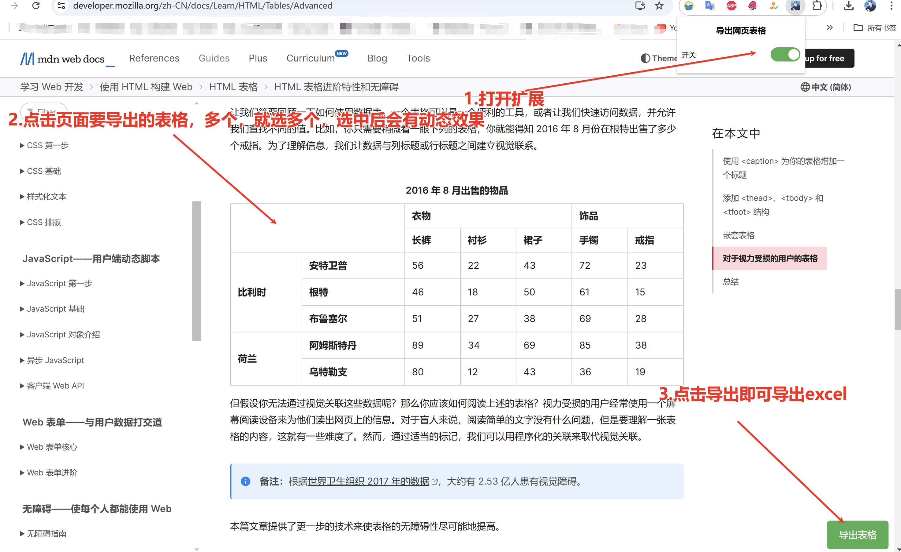

# 导出页面表格
感谢[@js-xlsx](https://github.com/protobi/js-xlsx) 提供的数据导出功能！
打开扩展
点击按钮即可导出当前页面的表格数据

## 安装
下载[chrom-excel.crx](https://github.com/herokl/chrom-excel/blob/main/chrom-excel.crx)文件，然后拖动到浏览器扩展程序页面即可
### Chrome

1. 打开 Chrome 浏览器
2. 点击右上角三个点，选择更多工具 -> 扩展程序
3. 打开右上角的开发者模式
4. 点击左上角的加载已解压的扩展程序
5. 选择项目中的 `chrome` 文件夹

### Firefox

1. 打开 Firefox 浏览器
2. 点击右上角三个点，选择附加组件 -> 扩展和主题
3. 打开右上角的开发者模式

### 如图所示

